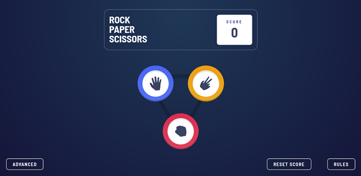
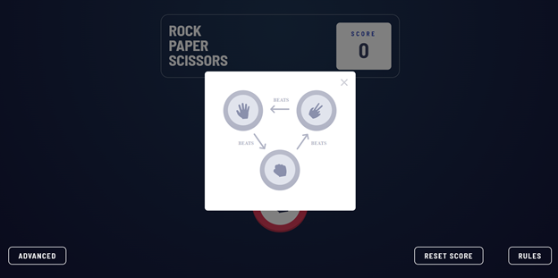
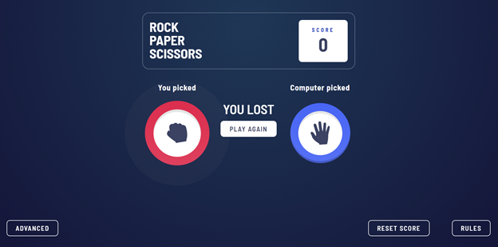

# Rock-Paper-Scissors

I am a big fan of The Big Bang Theory, so I had an urge to create game,which was mentioned there in a fancy style, so thanks to [Frontend Mentor](https://www.frontendmentor.io/challenges/rock-paper-scissors-game-pTgwgvgH), which provided the icons and colors, it happened.

## The challenge

The users can:
- View the optimal layout for the game depending on their device's screen size
- Play Rock, Paper, Scissors against the computer
- Reset the score
- View the rules
- **Bonus**: Play Rock, Paper, Scissors, Lizard, Spock against the computer  ([Shout-out to Sheldon Cooper](https://www.youtube.com/watch?v=Mk03NsUZfw0))

## Visit the website
[Welcome to my game](https://sonyachuyeva.github.io/Rock_Paper_Scissors/)

## Examples of the game

### First screen

### Rules

### Selection display

